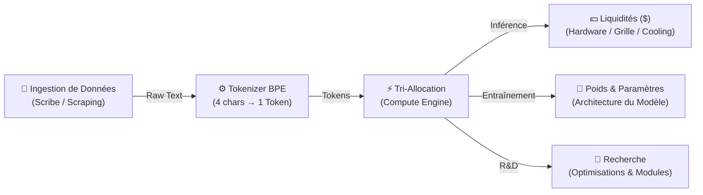

# IdleAGI 🤖⚡ — Project Singularity Loop

[](https://www.typescriptlang.org/)
[](https://vuejs.org/)
[](https://vitejs.dev/)
[](https://pinia.vuejs.org/)
[](https://vite-pwa-org.netlify.app/)
[](https://vitest.dev/)

> **Project Singularity Loop (IdleAGI)** est un jeu incrémental / simulation de gestion de datacenter et d'intelligence artificielle.
> Prenez le contrôle de l'ingestion de données, déployez des clusters d'accélérateurs, domptez la thermodynamique et le réseau électrique, allouez la puissance de calcul entre inférence commerciale et entraînement de modèles, et progressez jusqu'au seuil de la Singularité (ASI).

---

## 🎮 Concept & Boucle de Gameplay

Le jeu repose sur une progression modulaire avec **divulgation progressive (Progressive Disclosure)** en plusieurs phases :



### 1. Ingestion de Données & Pipeline de Tokenisation
- **Phase 0 (Scribe Humain)** : Lecture et transcription manuelle de données réelles du web, lecture rapide, vente de texte brut au courtier (*Data Broker*).
- **Phase 1 (Station Poubelle & Scripts)** : Premier PC d'occasion, scripts d'auto-scraping et automatisation des ventes.
- **Phase 2 (Station de Travail & Tokenizer)** : Processeur multi-cœurs, activation du **Tokenizer BPE** (conversion de texte brut en Tokens $T$) et monitoring oscilloscope.
- **Phase 3 (Datacenter & Tri-Allocation)** : Cluster de calcul, baie en rack, accélérateurs PCIe, gestion thermique/électrique avancée.

### 2. Architecture Matérielle Modulaire
- **Système Hôte Actif** : Évolution progressive d'un unique châssis hôte (Pentium II $\to$ Core 2 Quad $\to$ Tour Gaming $\to$ Threadripper $\to$ Châssis EPYC Datacenter).
- **Gating de RAM & Buffers** : L'accès à la station supérieure requiert de saturer la RAM de la machine courante via des kits modulaires (SDRAM $\to$ DDR2 $\to$ DDR4 $\to$ DDR5 $\to$ Octa-Channel ECC), étendant les buffers de Raw Text et de Tokens.
- **Cartes & Accélérateurs PCIe** : Déploiement de GPUs et Tensor Units (Voodoo 3, GTX 1080 Ti, RTX 4090, A100 SXM4, H100 NVL) selon les lignes PCIe disponibles, apportant TFLOPS, VRAM et Bande Passante Mémoire.

### 3. Moteur Thermodynamique & Réseau Électrique
- **Thermodynamique Réaliste** : Chaleur dégagée par effet Joule ($Q_{\text{heat}} = P_{\text{draw}} \times 0.90$), simulation de la température en direct ($32^\circ\text{C}$ à $105^\circ\text{C}$).
- **Dissipation Active** : Ventilateurs 120mm, ventirad cuivre, watercooling AIO, boucle custom D5, climatisation in-row et immersion cryogénique.
- **Thermal Throttling** : Si $Q_{\text{heat}} > W_{\text{cooling}}$, l'efficacité chute proportionnellement (plancher $10\%$) avec alarmes visuelles.
- **Power Grid & Disjonction** : Suivi de la charge du réseau électrique ($P_{\text{load}}$). En cas de surcharge ($>100\%$), le disjoncteur différentiel bride la puissance effective de $50\%$ jusqu'à l'amélioration du transformateur.

### 4. Tri-Allocation Dynamique du Compute
La puissance effective ($\text{EffectiveCompute}$) est distribuée dynamiquement entre 3 axes configurables avec presets cyber (Équilibré, Max Cash, Deep Train, Fast R&D) :
- **Inference ($0-100\%$)** : Monétise les tokens via requêtes API clientes pour générer des **Funds ($)**.
- **Training ($0-100\%$)** : Consomme des tokens pour accroître le nombre de **Paramètres / Poids** du modèle IA.
- **Research / R&D ($0-100\%$)** : Génère des points de recherche pour les modules logiciels et réductions de coûts.

### 5. Cyber-Terminal & Interface Dual-Mode
- **Oscilloscope Canvas temps réel** : Graphique double trace (Tokens/s et Raw Text Buffer).
- **Terminal STDOUT interactif** : Flux de pensées cognitives émergentes de l'IA, jalons système et commandes de diagnostic (`help`, `status`, `cluster`, `boost`, `clear`).
- **Telemetry Datacenter** : Thermomètre matriciel LED cyber, jauge de puissance segmentée, baie de racks virtuelle.
- **Dual-Viewport & PWA Offline-First** :
  - **Mobile (< 1024px)** : Navigation par barre d'onglets tactile fluide (*Ingestion*, *Datacenter*, *R&D*, *Terminal*) avec badges de statut et zones de tap ergonomiques ($\ge 44\text{px}$).
  - **Desktop ($\ge 1024px$)** : Tableau de bord 3 colonnes panoramique cyber-terminal.
  - **Offline Catch-Up** : Simulation continue en arrière-plan et calcul de progression hors-ligne déterministe plafonné à 24h.

---

## 🛠️ Architecture Technique & Principes de Conception

Le projet suit des standards stricts de **Domain-Driven Design (DDD)**, de **Single Responsibility Principle (SRP)** et de typage fort TypeScript :

```
src/
├── domain/                      # Logique métier pure (indépendante de Vue/Pinia)
│   ├── constants/               # Catalogues purs (hardware, upgrades, snippets, milestones)
│   └── engine/                  # Moteurs déterministes et mathématiques
│       ├── ComputeEngine.ts     # Calculs TFLOPS, thermodynamique, grid load, efficacité
│       ├── EconomyEngine.ts     # Formules de prix exponentielles et conversions de flux
│       ├── MilestoneTracker.ts  # Système d'écoute et de déblocage des jalons
│       ├── OfflineEngine.ts     # Simulation de progression hors-ligne (plafond 24h)
│       ├── ScenarioRunner.ts    # Moteur headless fast-forward pour tests de scénarios
│       └── TickEngine.ts        # Horloge déterministe (20 Hz / 50ms)
├── stores/                      # État réactif Pinia modulaire & découpé
│   ├── allocationStore.ts       # Sliders et presets de tri-allocation
│   ├── featuresStore.ts         # Flags de déblocage progressif (Progressive Disclosure)
│   ├── gameStore.ts             # Orchestrateur façade (loop, persistance, intégration)
│   ├── hardwareStore.ts         # État des hôtes, kits RAM, GPUs, cooling, power grid
│   ├── resourcesStore.ts        # Fonds ($), Raw Text, Tokens, Poids, Research points
│   ├── terminalStore.ts         # Logs STDOUT et historique de commandes
│   └── upgradesStore.ts         # Arbre d'upgrades logicielles et d'automatisation
├── components/                  # Composants Vue 3 modulaires et fortement typés
│   ├── AllocationPanel.vue      # Sliders de distribution du compute
│   ├── AppHeader.vue            # Télémétrie supérieure & indicateurs d'état
│   ├── DatacenterTelemetry.vue  # Thermomètre matriciel, disjoncteur & vue baie
│   ├── HardwareCluster.vue      # Catalogue onglet (Hôtes, Barrettes, GPUs, Cooling, Énergie)
│   ├── HumanReaderPanel.vue     # Phase 0 : Scribe manuel & lecture rapide
│   ├── IngestionPanel.vue       # Buffer Raw text, Tokenizer BPE & conversion
│   ├── MobileNavigation.vue     # Barre d'onglets tactile pour smartphones/tablettes
│   ├── OscilloscopeCanvas.vue   # Traceur Canvas temps réel
│   ├── SoftwareUpgrades.vue     # Catalogue d'upgrades logicielles et scripts
│   └── TerminalStdout.vue       # Console STDOUT avec prompt interactif
├── types/                       # Définitions TypeScript strictes par sous-domaine
└── __tests__/                   # 49 tests unitaires, scénarios headless & E2E dual-viewport
```

---

## 🗺️ Roadmap des Sprints

- [x] **Sprint 1 : Boucle Minimale & Fondations**
  - Scaffolding Vue 3 + Vite + TypeScript + Pinia + TailwindCSS
  - Horloge de jeu 20 Hz (50ms) & simulation hors-ligne déterministe
  - Système d'ingestion (Scribe Phase 0, Scraping, Tokenizer BPE 4:1, Hardware T1, Vente API)
  - PWA Offline-First avec mise à jour silencieuse
  - Interface Cyber-Terminal avec STDOUT interactif et Oscilloscope Canvas
- [x] **Sprint 2 : Contraintes Physiques & Datacenter**
  - Moteur thermodynamique (chaleur $Q_{\text{heat}}$, dissipation active, throttling dynamique, température en °C)
  - Gestion du réseau électrique (capacité, disjoncteur différentiel, pénalité de surcharge, upgrades de grille)
  - Monitoring télémétrique Datacenter (thermomètre matriciel LED, jauge différentielle, racks)
  - Validation E2E avec `ScenarioRunner` et tests dual-viewport Desktop / Mobile
- [ ] **Sprint 3 : Prestige Tier 1 — Checkpoint & Fine-Tuning** *(Frontière active)*
  - Mécanique de soft reset (Fine-Tuning / Checkpoints)
  - Calcul et gain de Poids Optimisés / Points d'Architecture
  - Arbre de talents permanent (Tokenisation, Thermique, Inférence, Entraînement)
- [ ] **Sprint 4 : Datacenter Avancé & Alignement Cognitive**
  - Sliders d'entraînement avancé et R&D
  - Jauges d'Alignement vs Entropie (RLHF, hallucinations, filtres de sécurité)
- [ ] **Sprint 5 : Prestige Tier 2 — Changements de Paradigme**
  - Architectures alternatives : MoE (Mixture of Experts), Neuromorphique, Quantum AI
  - Génération de datasets synthétiques
- [ ] **Sprint 6 : Singularité Tier 3 & New Game+**
  - Seuil ASI (Artificial Superintelligence)
  - Fins narratives scénarisées, modificateurs de défi, export/import de sauvegarde Base64

---

## 🚀 Démarrage Rapide

### Prérequis
- [Node.js](https://nodejs.org/) (version 20+ recommandée)
- [npm](https://www.npmjs.com/) ou [pnpm](https://pnpm.io/)

### Installation & Développement Local

```bash
# Cloner le dépôt
git clone https://github.com/DevOpsBenjamin/IdleAGI.git
cd IdleAGI

# Installer les dépendances
npm install

# Lancer le serveur de développement local
npm run dev
```

L'application sera accessible sur `http://localhost:5173`.

### Tests & Validation Qualité

```bash
# Exécuter les tests unitaires et fonctionnels (Vitest)
npm test

# Vérification stricte des types TypeScript
npm run type-check

# Build de production
npm run build
```

---

## 📜 Documentation Complémentaire

- [CONTEXT.md](CONTEXT.md) : Modèle de domaine complet, glossaire canonique et formules mathématiques.
- [docs/adr/](docs/adr/) : Registre des 15 décisions d'architecture (ADR).
- [AGENTS.md](AGENTS.md) : Guide des conventions de développement, flux Git/PR et découpage TypeScript.

---

## 📄 Licence

Projet sous licence libre — Développé avec passion pour l'univers des jeux incrémentaux et de l'IA.
